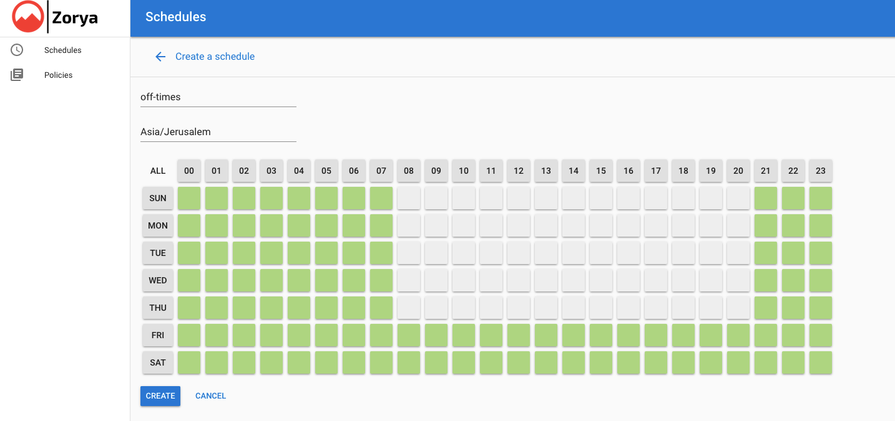
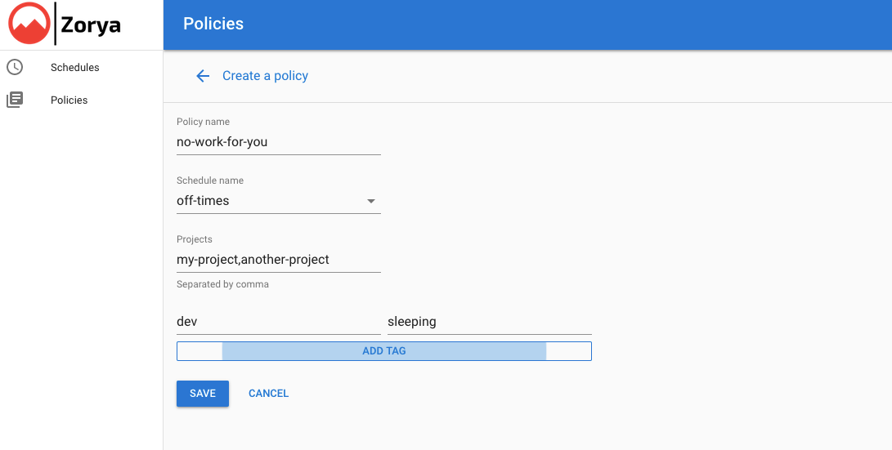

# zorya

Schedule GCE Instances, Cloud SQL and GKE node pools

[Blog Post](http://bit.ly/zorya_blog)

[](LICENSE) [](https://github.com/doitintl/zorya)

In Slavic mythology, [Zoryas](https://www.wikiwand.com/en/Zorya) are two guardian goddesses. The Zoryas represent the morning star and the evening star, — if you have read or watched Neil Gaiman’s American Gods, you will probably remember these sisters).

## Installation

```shell
pip install -r requirements.txt -t lib
```

Next step: Download and install [Yarn](https://yarnpkg.com/).

### Known Issues for Installation

* Deployment from Google Cloud Shell fails with an error [#25](https://github.com/doitintl/zorya/issues/25).

* Building on macOS running on Apple Silicon (arm M1) may fail due to issues building grpcio. Use the following workaround:

>```shell
>GRPC_PYTHON_BUILD_SYSTEM_OPENSSL=1 \
>  GRPC_PYTHON_BUILD_SYSTEM_ZLIB=1 \
>  pip install -r requirements.txt -t lib
>```

## Enable required GCP APIs:

* Cloud Tasks
* App Engine
* Cloud Storage
* Datastore
* IAP
* Cloud Build
* Cloud Scheduler
* Compute Engine
* Cloud SQL Admin API

## Deploy Backend and GUI:
```shell
./deploy.sh project-id
```


#### Access the app
```shell
gcloud app browse
```

**WARNING**: By default this application is public; ensure you turn on IAP, as follows:

To sign into the app, we are using [Cloud Identity-Aware Proxy (Cloud IAP)](https://cloud.google.com/iap/). Cloud IAP works by verifying a user’s identity and determining if that user should be allowed to access the application. The setup is as simple as heading over to [GCP console](https://console.cloud.google.com/iam-admin/iap), enabling IAP on your GAE app and adding the users who should have access to it.

#### Authorization

For Zorya to work, its service account requires the folling roles:

* Cloud Tasks Enqueuer
* Cloud Datastore User
* Logs Writer

For any project that Zorya is supposed to be managing resources for, Zorya's service account requires the following additional roles:

* Compute Instance Admin (v1)
* Kubernetes Engine Cluster Admin
* Cloud SQL Editor


The name of the service account you will need to assign permissions to is as following:`<YOUR_PROJECT_ID>@appspot.gserviceaccount.com` and will have been automatically created by Google App Engine. *NOTE:* this is done under *IAM*, selecting the account, choosing *Permissions* and then adding the roles above to it; not under *Service Accounts*.

## Flow

* Every hour on the hour a cron job calls `/tasks/schedule` which loop over all the policies
* We are checking the desired state vs the previous hour desired state. If they are not the same we will apply the change.

[API Documentation](http://bit.ly/zorya_api_docs)

### Creating a Schedule



### Creating a Policy


