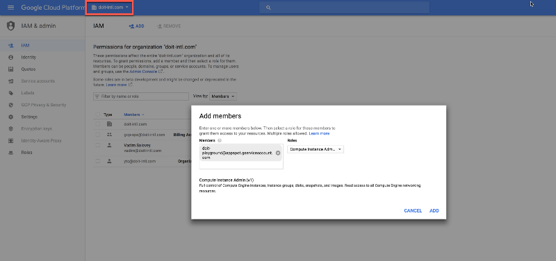

# zorya
GCP Instance, Cloud SQL Scheduler & GKE node pools

[Blog Post](http://bit.ly/zorya_blog)

 

In Slavic mythology, [Zoryas](https://www.wikiwand.com/en/Zorya) are two guardian goddesses. The Zoryas represent the morning star and the evening star, — if you have read or watched Neil Gaiman’s American Gods, you will probably remember these sisters).

##### Install dependencies

 - Note: deployment from Google Cloud Shell fails with an error [#25](https://github.com/doitintl/zorya/issues/25).

`pip install -r requirements.txt -t lib`

Download and install [Yarn](https://yarnpkg.com/).

##### Deploy
`./deploy.sh project-id`

You need to enable compute engine API (https://console.cloud.google.com/apis/library/compute.googleapis.com) for the Zorya project/app to work and communicate with compute engine instances.

#### Access the app
`gcloud app browse`

**WARNING**: By default this application is public; ensure you turn on IAP, as follows:

To sign into the app, we are using [Cloud Identity-Aware Proxy (Cloud IAP)](https://cloud.google.com/iap/). Cloud IAP works by verifying a user’s identity and determining if that user should be allowed to access the application. The setup is as simple as heading over to [GCP console](https://console.cloud.google.com/iam-admin/iap), enabling IAP on your GAE app and adding the users who should have access to it.

#### Authentication
In order to allow Zorya to manage instances on your behalf in any project under your organization, you will need to create a new entry in your Organization IAM and assign Zorya’s service account with a role of XXXX
First, navigate to https://console.cloud.google.com, then IAM from the menu and then select the name of your project that you deployed zorya in, from the dropdown at the top of the page:

The name of the service account you will need to assign permissions to is as following:`<YOUR_PROJECT_ID>@appspot.gserviceaccount.com` and will have been automatically created by Google App Engine. *NOTE:* this is done under *IAM*, selecting the account, choosing *Permissions* and then adding the role **Compute Instance Admin (v1)** to it; not under *Service Accounts*.

## Flow

* Every hour on the hour a cron job calls `/tasks/schedule` which loop over all the policies
* We are checking the desired state vs the previous hour desired state. If they are not the same we will apply the change.

[API Documentation](http://bit.ly/zorya_api_docs)

####  Creating a Schedule

####  Creating a Policy

